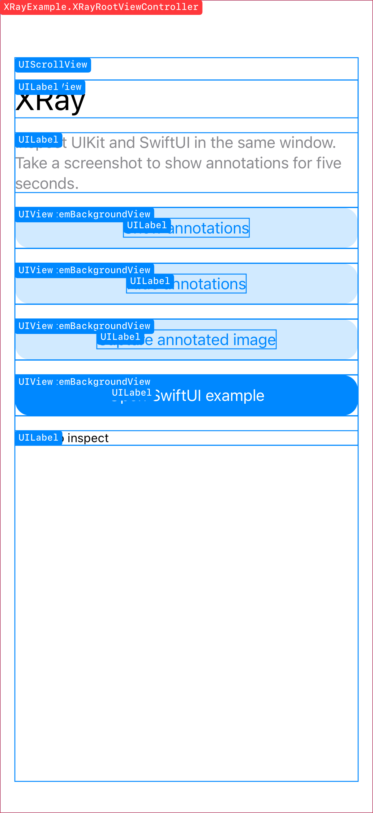
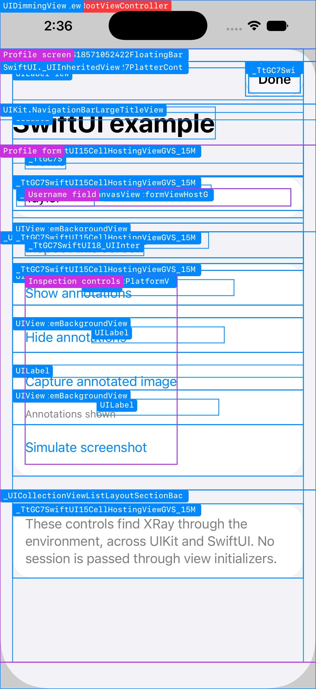

# XRay

See the views behind your iOS interface. XRay draws a live hierarchy over UIKit and SwiftUI screens, captures annotated images, and works from LLDB.

**iOS / iPadOS 17+ · Swift 6 · Swift Package Manager · MIT**

<p>
  
  
</p>

This refactor is unreleased. The examples below describe the working tree; existing 1.x tags use the [legacy API](#migrating-from-1x).

## Start with one line

For a SwiftUI app, attach XRay to each window's root:

```swift
import SwiftUI
import XRay

@main
struct ExampleApp: App {
    var body: some Scene {
        WindowGroup {
            ContentView()
                .xray()
        }
    }
}
```

For UIKit, install it on your scene's window after creating it. This works with storyboard and programmatic roots, including hosted SwiftUI:

```swift
import UIKit
import XRay

func scene(_ scene: UIScene, willConnectTo session: UISceneSession,
           options connectionOptions: UIScene.ConnectionOptions) {
    // A storyboard supplies this window; programmatic apps create theirs first.
    if let window {
        XRay.install(in: window)
    }
}
```

Take a device screenshot to show annotations for five seconds. Apple delivers the notification **after** taking the screenshot, so that first image does not contain the new overlay. Use `capture()` or LLDB to save an annotated image directly.

Installation is retained once per window. Repeated installation updates its configuration. Call `XRay.uninstall(from: window)` to remove it. SwiftUI installations last while at least one `.xray()` root is attached to that window.

## Inspect from any descendant

XRay's context follows Apple's UIKit trait and SwiftUI environment system. A deeply nested view can use it without receiving a session through every initializer:

```swift
struct DebugControls: View {
    @Environment(\.xray) private var xray

    var body: some View {
        Button("Show XRay") { xray.show() }
        Button("Hide XRay") { xray.hide() }
    }
}
```

UIKit descendants use the same context:

```swift
traitCollection.xray.show()
let snapshot = try traitCollection.xray.capture()
let image = snapshot.image
print(snapshot.hierarchy)
```

These UI APIs run on the main actor. Without an installation, inherited show/hide actions are harmless and capture reports an unavailable target.

## Give SwiftUI views meaningful names

UIKit inspection includes the rendered backing hierarchy. Add names to the SwiftUI components you want to recognize:

```swift
VStack {
    ProfileHeader()
        .xrayLabel("Profile header")
    AccountForm()
        .xrayLabel("Account form")
}
.xrayLabel("Profile screen")
```

Labels record live bounds and their nearest labeled SwiftUI ancestor. Purple outlines identify these semantic nodes; blue outlines identify UIKit views and red outlines identify view-controller roots. Annotations allow touches through and stay out of the accessibility tree.

Apply labels to concrete layout containers such as `VStack`, rather than `Group`, which can distribute modifiers across several children.

SwiftUI does not expose a public API for enumerating every original `View` value. `.xrayLabel` supplies that semantic information explicitly, using public APIs and lightweight layout markers. It does not reflect into SwiftUI's private storage.

## Capture or inspect a specific view

Keep a session when you want to inspect only a subtree, without screenshot activation:

```swift
let xray = XRay(view: contentView)
// Or: XRay(rootViewController: controller)
xray.show()

let snapshot = try xray.capture()
let png = snapshot.image.pngData()
let nodes = snapshot.hierarchy.nodes

xray.hide()
```

`capture()` preserves the live overlay's state. `hierarchy()` returns node names, kinds, parent IDs, bounds, transformed corners, and clipping rectangles. Both throw a descriptive `XRayError` when unavailable. IDs are temporary inspection identifiers, not persistent model IDs.

Configure either entry point:

```swift
XRay.install(in: window, configuration: .init(
    filter: .application,
    showsLabels: true,
    maximumViews: 2_000,
    maximumDepth: 64,
    screenshotDuration: 5
))
```

The application filter excludes classes from Apple bundles while retaining SwiftUI labels. Limits cap native traversal and returned nodes; `hierarchy.isTruncated` reports omitted content. A nonpositive screenshot duration keeps the overlay visible until hidden. Manual `show()` cancels screenshot expiry.

## LLDB

Link and install XRay in the app's Debug build, pause on the main thread, then import the bundled command:

```lldb
command script import "/absolute/path/to/XRay/Tools/xray_lldb.py"
xray tree
xray capture --open
xray show
continue
```

`xray capture` transfers an annotated PNG to your Mac. `--open` displays it in the default image viewer. Commands never resume the app automatically, overwrite an existing output, or modify `.lldbinit`.

See [LLDB setup and troubleshooting](docs/LLDB.md) for output paths, multi-window behavior, and device-validation limits.

## Install and run the example

Add the `XRay` package product to your iOS app. Until this refactor is published, use this checkout as a local package:

```swift
.package(path: "../XRay")
```

In Xcode, use **Add Local Package** and select the repository folder. The included [example project](XRayExample/XRayExample.xcodeproj) already references the local package and demonstrates storyboard UIKit, programmatic controls, and a hosted SwiftUI form.

XRay is inactive in Release builds: no screenshot observers, trait installation, live overlays, or SwiftUI markers are installed. Explicit capture and hierarchy requests throw `.disabled`. Debug tooling is not a security boundary; use your normal release configuration when shipping.

## Scope and limitations

- Supports iOS and iPadOS. Other Apple platforms are not package targets.
- Inspects the currently rendered hierarchy. Offscreen list rows and unmounted SwiftUI destinations are not materialized.
- UIKit snapshots may omit protected, video, Metal, and other externally rendered content. Rectangular clipping is approximate for masks, rounded corners, and rotated clipping ancestors.
- Screenshot notifications contain no scene identifier. Each installed, visible foreground window responds; explicit sessions select one window. LLDB requires exactly one active key content window and reports ambiguity otherwise.
- Capture dimensions and pixel count are bounded to avoid excessive allocation. A capture can fail when the target is unavailable or UIKit cannot render at the current execution point.

## Migrating from 1.x

The minimum deployment target moves from iOS 11 to **iOS 17** for custom UIKit traits and the UIKit–SwiftUI environment bridge. Swift 6 makes main-actor access explicit.

| 1.x | Current API |
| --- | --- |
| App-level screenshot observer and delayed cleanup | `.xray()` or `XRay.install(in: window)` |
| `captureXray(classNameOption: .all)` | `show()` |
| `captureXray(classNameOption: .customClass)` | Configure `filter: .application`, then `show()` |
| `refresh(classNameOption:)` | Update `configuration`, then `refresh()` |
| `removeXray()` | `hide()` |
| No image return value | `try capture()` returns image and hierarchy |

The old methods remain as deprecated adapters. Remove your old screenshot observer when adopting installation so that one owner handles activation and cleanup.

## Development

[Validation notes](docs/Validation.md) record the tested SDKs, regression cases, and remaining runtime coverage. The design follows [Swift API Design Guidelines](https://www.swift.org/documentation/api-design-guidelines/) and the trait/environment bridge introduced in Apple's [WWDC23 UIKit session](https://developer.apple.com/videos/play/wwdc2023/10057/?time=1524).

[MIT license](LICENSE) · [Shawn Baek](https://github.com/ShawnBaek)
