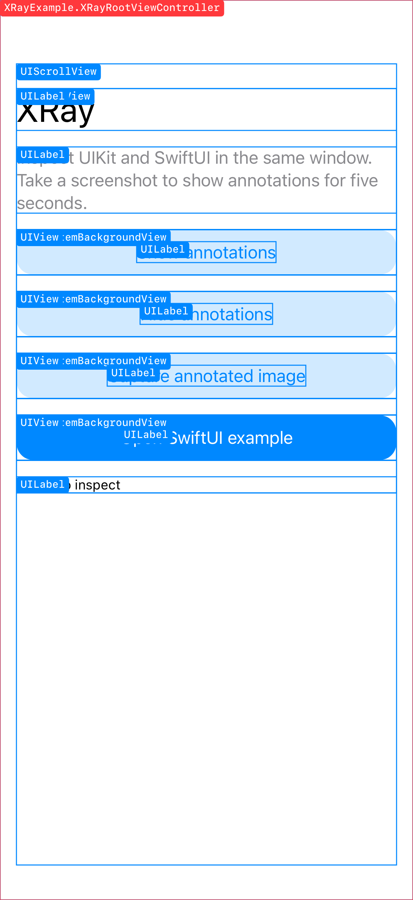
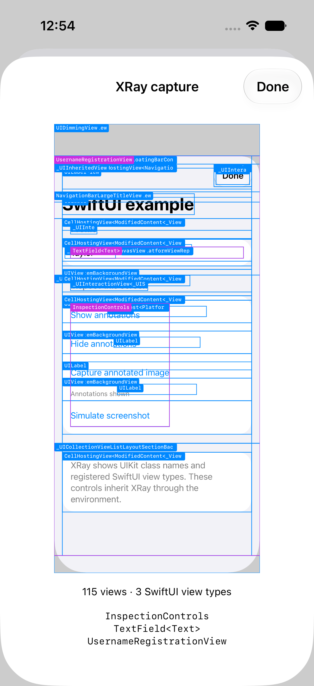
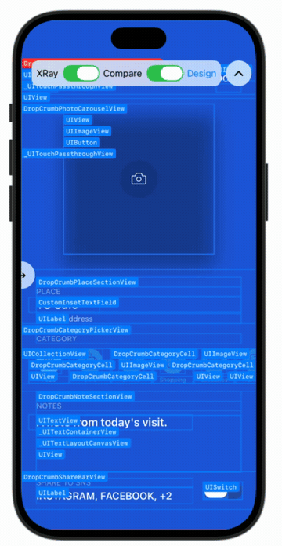

# XRay

See concrete UIKit controller, UIView and SwiftUI type names on screen. XRay draws live outlines, captures annotated images, and compares Xcode previews with saved Figma designs. UIKit names are automatic; SwiftUI types are recorded where you attach `.preview()`, `.xray()` or `.xrayView()`.

**iOS / iPadOS 17+ · Swift 6 · Swift Package Manager · MIT**

<p>
  
  
</p>

This refactor is unreleased. The examples below describe the working tree; existing 1.x tags use the [legacy API](#migrating-from-1x).

## Xcode previews

<p>
  
</p>

Drag the divider to compare a saved design with the running implementation.
The recording above demonstrates the comparison in TravelCrumbs; the fixture
and reference intentionally contain different content.

SwiftUI views, `UIView`s and `UIViewController`s share the same helper.
Replace the sample screen types and initializers below with your own:

```swift
import SwiftUI
import XRay

#Preview("UIKit controller") {
    NoteViewController(note: "A synthetic sample")
        .preview(xray: true)
}

#Preview("UIKit view") {
    ProfileHeaderView(name: "Taylor")
        .preview(xray: true)
}

#Preview("SwiftUI") {
    ProfileView(model: .sample)
        .preview(xray: true)
}
```

Each preview has its own XRay switch and inspection session. Inspection starts
off by default; `xray: true` turns it on initially. Add
`reference: .resource("note", bundle: referenceBundle)` for an offline Figma
comparison with a draggable vertical divider. Pass the bundle that owns the
reference. The canvas fills the Preview, with collapsible floating controls;
inject mock data through the screen's normal initializer.

- **XRay** toggles inspection without recreating the screen or resetting edits.
- **Compare** reveals the full implementation when switched off.
- **Design** opens the reference's source link, when available.
- The collapse button hides the controls without resizing the preview.

To attach a saved reference:

```swift
#Preview("Design comparison") {
    NoteViewController(note: "A synthetic sample")
        .preview(
            xray: true,
            reference: .resource("note", bundle: Bundle(for: NoteViewController.self))
        )
}
```

The owning bundle must contain both files at these paths:

```text
XRayReferences/note/reference.png
XRayReferences/note/metadata.json
```

Preserve this directory structure with an Xcode folder resource or SwiftPM's
`.copy("XRayReferences")` resource rule. `Bundle(for:)` works when the controller
belongs to the resource-owning target; a Swift package consumer should pass its
own `Bundle.module` instead.

The Mac [Figma Desktop sync tool](Tools/XRayDesign/README.md) registers the frame,
exports the reference, and generates a Swift catalog. Preview itself stays
offline and needs no Figma credentials. Mark preview resources as Development
Assets when they must be excluded from app archives; `#if DEBUG` alone does not
exclude copied images. In Release, `.preview()` keeps the underlying content
without inspection controls or reference loading.

Read [Previewing](Sources/XRay/XRay.docc/Previewing.md) and the
[Figma Desktop sync tool](Tools/XRayDesign/README.md) for resource setup,
explicit design updates, authentication boundaries and packaging. The `.docc`
catalog is also available through Xcode's Build Documentation command.
[Preview validation](docs/PreviewValidation.md) records the checks and remaining limits.

## Start with one line

For a SwiftUI app, attach XRay to each window's root. This installs inspection and records the root's type name, `ContentView`:

```swift
import SwiftUI
import XRay

@main
struct ExampleApp: App {
    var body: some Scene {
        WindowGroup {
            ContentView()
                .xray()
        }
    }
}
```

For UIKit, install it on your scene's window after creating it. XRay automatically shows each rendered `UIView` subclass name, such as `UILabel` or your own `ProfileHeaderView`. This works with storyboard and programmatic roots, including hosted SwiftUI:

```swift
import UIKit
import XRay

func scene(_ scene: UIScene, willConnectTo session: UISceneSession,
           options connectionOptions: UIScene.ConnectionOptions) {
    // A storyboard supplies this window; programmatic apps create theirs first.
    if let window {
        XRay.install(in: window)
    }
}
```

Take a device screenshot to show annotations for five seconds. Apple delivers the notification **after** taking the screenshot, so that first image does not contain the new overlay. Use `capture()` or LLDB to save an annotated image directly.

Installation is retained once per window. Repeated installation updates its configuration. Call `XRay.uninstall(from: window)` to remove it. SwiftUI installations last while at least one `.xray()` root is attached to that window.

## Inspect from any descendant

XRay's context follows Apple's UIKit trait and SwiftUI environment system. A deeply nested view can use it without receiving a session through every initializer:

```swift
struct DebugControls: View {
    @Environment(\.xray) private var xray

    var body: some View {
        Button("Show XRay") { xray.show() }
        Button("Hide XRay") { xray.hide() }
    }
}
```

UIKit descendants use the same context:

```swift
traitCollection.xray.show()
let snapshot = try traitCollection.xray.capture()
let image = snapshot.image
print(snapshot.hierarchy)
```

These UI APIs run on the main actor. Without an installation, inherited show/hide actions are harmless and capture reports an unavailable target.

## Readable type labels

UIKit root-view captions show the concrete owning controller, such as
`TravelCrumbViewController`; ordinary subviews show their concrete view class.
The hierarchy still records both the view class and controller separately.
Captions use the available visible space, shrink from 10 to 8 points when needed,
and wrap long names instead of clipping them. Semantic SwiftUI and controller
names receive placement priority. Hosting-container captions are hidden, and
crowded captions are omitted rather than drawn over each other; their outlines
and full hierarchy entries remain available.

For example, a `TravelCrumbViewController: UIViewController` root is captioned
`TravelCrumbViewController`. `TravelCrumb().preview(xray: true)` is captioned
`TravelCrumb`, not its underlying SwiftUI hosting view.

## Show SwiftUI view type names

Register nested SwiftUI views at their call sites. XRay infers their types, so there is no name string to keep in sync:

```swift
VStack {
    ProfileHeader()
        .xrayView() // ProfileHeader
    AccountForm()
        .xrayView() // AccountForm
}
```

Inside a custom view's `body`, pass `Self.self` to show the enclosing view's type instead of its layout container:

```swift
struct ProfileHeader: View {
    var body: some View {
        VStack {
            Text("Taylor")
            Text("Account details")
        }
        .xrayView(Self.self) // ProfileHeader, rather than VStack<...>
    }
}
```

Choose registration at the call site or inside `body`; using both records two annotations. Common modifiers preserve the underlying view's name. Generic views retain their generic parameters, such as `TextField<Text>`. For an optional caption, use `ProfileHeader().xrayLabel("Signed-in account")`; the type name remains `ProfileHeader`.

Registered types record live bounds and their nearest registered SwiftUI ancestor. Purple outlines identify SwiftUI types; blue outlines identify UIKit classes, and red outlines identify UIKit views owned by a view controller. Red captions show the concrete controller name; the hierarchy preserves the view class in `name` and its owner in `viewControllerName`. Annotations allow touches through and stay out of the accessibility tree.

Apply registration to concrete layout containers rather than `Group`, which can distribute modifiers across several children. SwiftUI does not expose a public API for automatically enumerating every original `View` type. XRay uses public APIs and lightweight layout markers at the registration points above. Register before erasing a view to `AnyView`; otherwise, the available type name is `AnyView`.

## Capture or inspect a specific view

Keep a session when you want to inspect only a subtree, without screenshot activation:

```swift
let xray = XRay(view: contentView)
// Or: XRay(rootViewController: controller)
xray.show()

let snapshot = try xray.capture()
let png = snapshot.image.pngData()
let nodes = snapshot.hierarchy.nodes

xray.hide()
```

`capture()` preserves the live overlay's state. `hierarchy()` returns each node's actual class or registered view type in `name`, optional caption in `label`, and optional owning controller in `viewControllerName`, along with kinds, parent IDs, bounds, transformed corners, and clipping rectangles. Both throw a descriptive `XRayError` when unavailable. IDs are temporary inspection identifiers, not persistent model IDs.

Configure either entry point:

```swift
XRay.install(in: window, configuration: .init(
    filter: .application,
    showsLabels: true,
    maximumViews: 2_000,
    maximumDepth: 64,
    screenshotDuration: 5
))
```

The application filter excludes classes from Apple bundles while retaining registered SwiftUI types and root views owned by application controllers, including plain `UIView` roots. Limits cap native traversal and returned nodes; `hierarchy.isTruncated` reports omitted content. A nonpositive screenshot duration keeps the overlay visible until hidden. Manual `show()` cancels screenshot expiry.

## LLDB

Link and install XRay in the app's Debug build, pause on the main thread, then import the bundled command:

```lldb
command script import "/absolute/path/to/XRay/Tools/xray_lldb.py"
xray tree
xray capture --open
xray show
continue
```

`xray capture` transfers an annotated PNG to your Mac. `--open` displays it in the default image viewer. Commands never resume the app automatically, overwrite an existing output, or modify `.lldbinit`.

See [LLDB setup and troubleshooting](docs/LLDB.md) for output paths, multi-window behavior, and device-validation limits.

## Install and run the example

Add the `XRay` package product to your iOS app. Until this refactor is published, use this checkout as a local package:

```swift
.package(path: "../XRay")
```

In Xcode, use **Add Local Package** and select the repository folder. The included [example project](XRayExample/XRayExample.xcodeproj) already references the local package and demonstrates storyboard UIKit, programmatic controls, and a hosted SwiftUI form.

XRay is inactive in Release builds: no screenshot observers, trait installation, live overlays, or SwiftUI markers are installed. Explicit capture and hierarchy requests throw `.disabled`. Debug tooling is not a security boundary; use your normal release configuration when shipping.

## Scope and limitations

- Supports iOS and iPadOS. Other Apple platforms are not package targets.
- Inspects the currently rendered hierarchy. Offscreen list rows and unmounted SwiftUI destinations are not materialized.
- UIKit snapshots may omit protected, video, Metal, and other externally rendered content. Rectangular clipping is approximate for masks, rounded corners, and rotated clipping ancestors.
- Screenshot notifications contain no scene identifier. Each installed, visible foreground window responds; explicit sessions select one window. LLDB requires exactly one active key content window and reports ambiguity otherwise.
- Capture dimensions and pixel count are bounded to avoid excessive allocation. A capture can fail when the target is unavailable or UIKit cannot render at the current execution point.

## Migrating from 1.x

The minimum deployment target moves from iOS 11 to **iOS 17** for custom UIKit traits and the UIKit–SwiftUI environment bridge. Swift 6 makes main-actor access explicit.

| 1.x | Current API |
| --- | --- |
| App-level screenshot observer and delayed cleanup | `.xray()` or `XRay.install(in: window)` |
| `captureXray(classNameOption: .all)` | `show()` |
| `captureXray(classNameOption: .customClass)` | Configure `filter: .application`, then `show()` |
| `refresh(classNameOption:)` | Update `configuration`, then `refresh()` |
| `removeXray()` | `hide()` |
| No image return value | `try capture()` returns image and hierarchy |

The old methods remain as deprecated adapters. Remove your old screenshot observer when adopting installation so that one owner handles activation and cleanup.

## Development

[Validation notes](docs/Validation.md) record the tested SDKs, regression cases, and remaining runtime coverage. The design follows [Swift API Design Guidelines](https://www.swift.org/documentation/api-design-guidelines/) and the trait/environment bridge introduced in Apple's [WWDC23 UIKit session](https://developer.apple.com/videos/play/wwdc2023/10057/?time=1524).

[MIT license](LICENSE) · [Shawn Baek](https://github.com/ShawnBaek)
